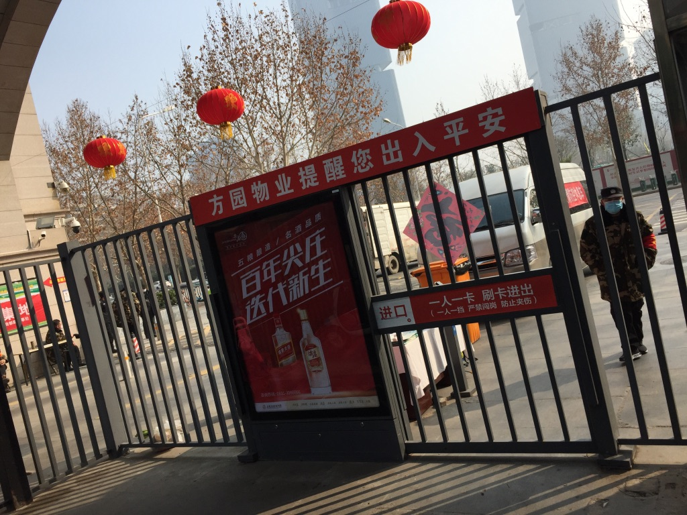
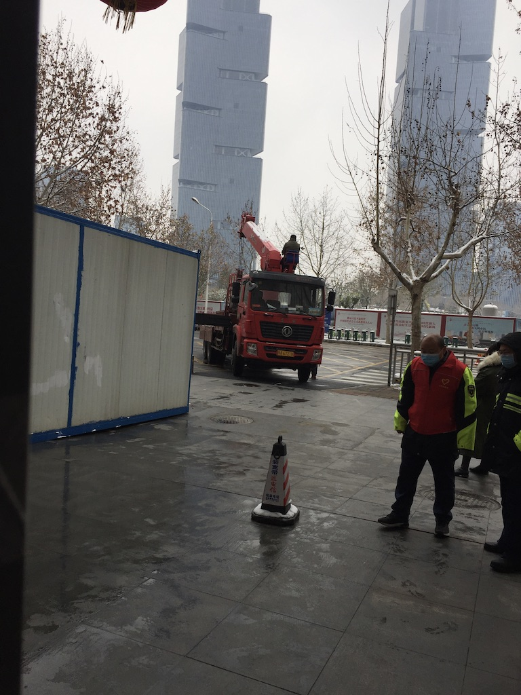
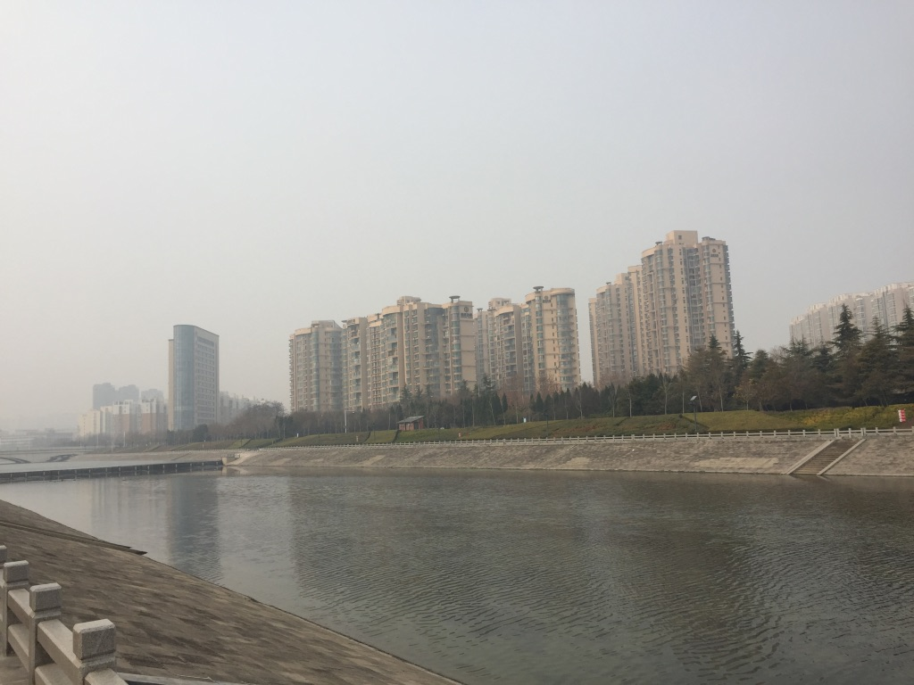

2020 年最让人想不到的事情就是新型冠状病毒引发的疫情(新冠病毒疫情)了.
春节年假之前, 隐约中有关于疫情的消息在周围传播, 但是自己并没有太大的重视,
以为是过几天就过去了.
公司里的一个同事从武汉回来, 开玩笑说周围有人在 ,大家还是嘻嘻哈哈.

返家的途中, 乘坐地铁去火车站的时候, 发现地铁上的人基本上都戴着口罩, 而且似乎有点空荡荡的,
当时才感觉事情有点不太寻常.

回家之后, 感觉与之前的春节并没有什么不同.
只是从新闻上看到的消息, 似乎河南的管控已经非常严格.
初三从外婆家出来的时候, 村口已经开始封路检查.

返回郑州之后, 小区已经不允许自由出入, 人员必须登记进出. 之后,随着疫情的发展, 防疫指挥部的文件也渐次发布, 管理制度也在变化.
每天限制每户外出人数,而且只能在规定时间段内外出.

天气降温, 小区门口也打了一个简易的住所,给门口的保安和防疫人员使用.

公司开始商量远程办公的事情.
但是最后实际上并没有实施,因为创业公司当下并没有急需的业务要做.
由此也开始了一个最长的假期.

本来是准备学习点新的东西,但是自己一直处于严重的鼻炎发作状态. 所以每天除了看点书,
就是去附近的河边闲逛.
