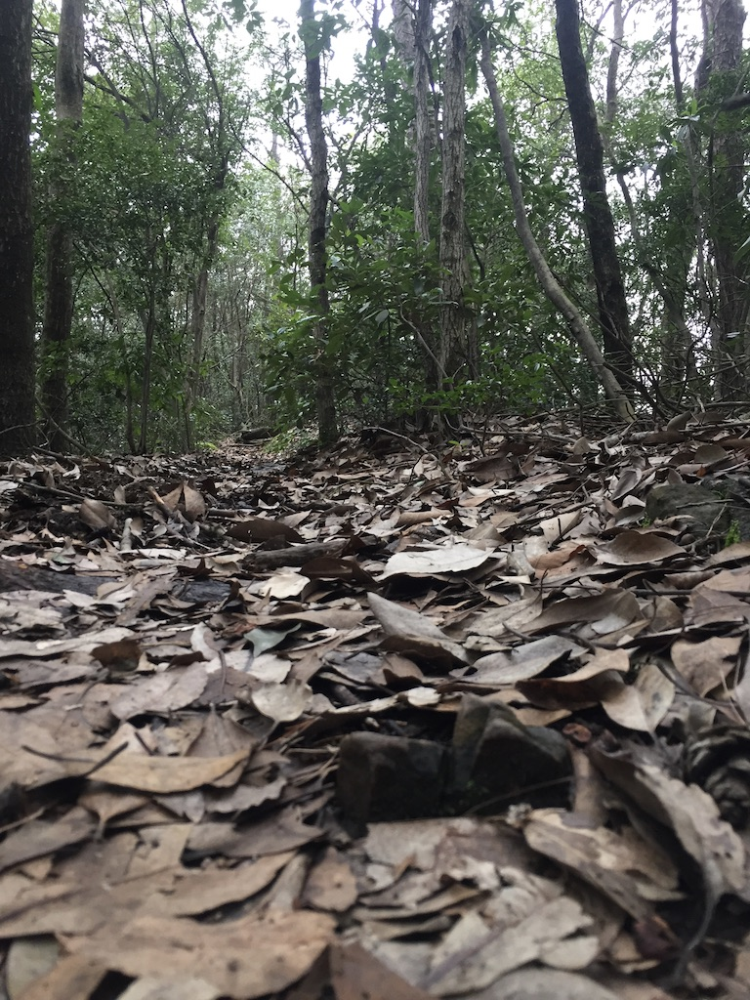
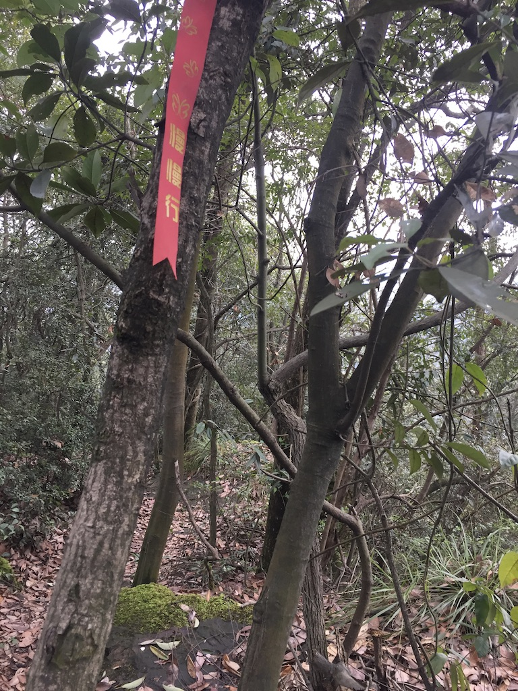

时值周六, 虽疫情未过, 然天气晴好, 心动欲出, 遂背包骑车, 往杭州一景, 名为九溪烟树者去也.

骑行至地图中所示终点处止, 前方碎石铺路, 车马难行.
于是下车步行. 旁有小山, 有阶梯其上.
将至山顶, 有数人踟躇而下, 旁人问曰: 上无路否?
中有一人答曰: 及上无他路, 必以此原路返回也.

虽听得此言, 但正是时光多余, 于是乃登援而上.
未几, 至得山顶. 上有平地十数方. 漫步而行, 见右侧隐约似有人行成路痕迹.
乃沿其而下.
其路纯以人日久, 较上山之路更为难行.
其间脚下打滑, 跌坐泥路之中, 摩拜风亦出乎衣兜, 摔落尘埃.

行数分, 抬头见一红色丝缎系于道旁, 上有字曰: 慢慢行.
继续行约一刻, 山势渐成. 又渐闻汽车鸣笛之声, 乃知此路将出山也.
又前行数十米, 眼界渐阔, 嘉树列次, 茶园也.

及至山下, 回望既往, 乃知人言不如行路, 行事必须躬亲.
