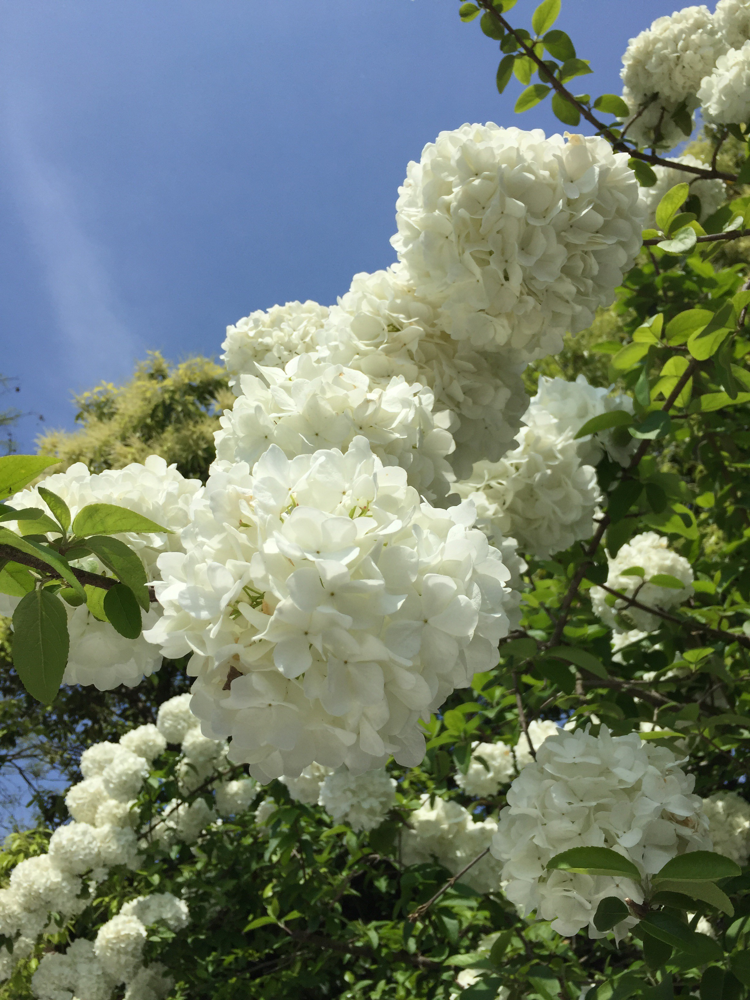
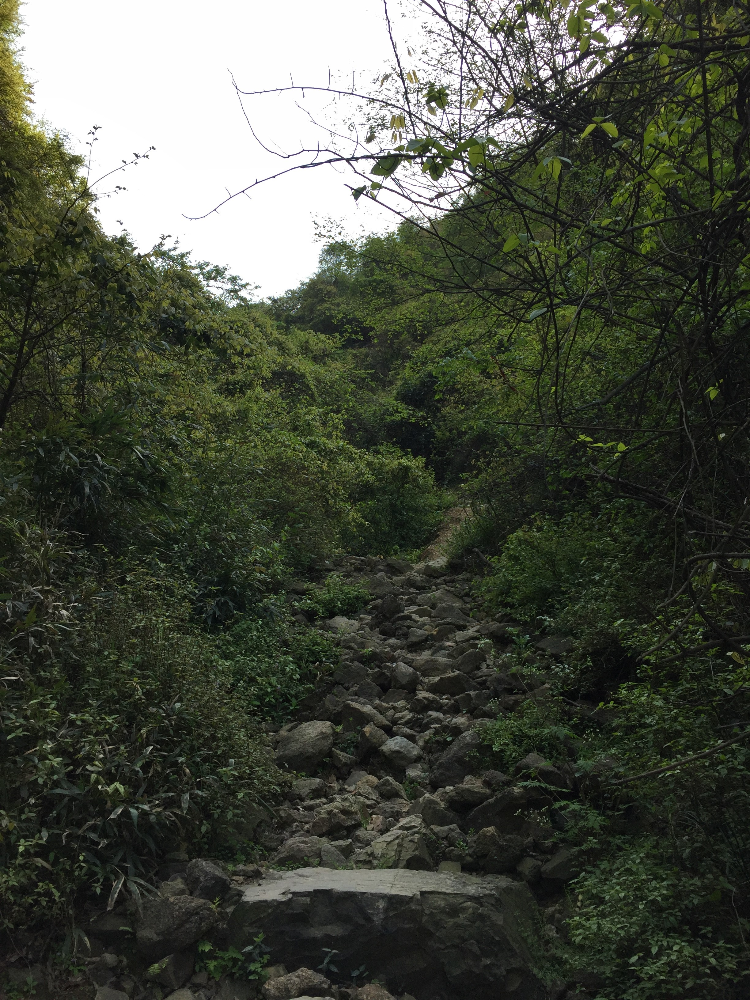

时值清明，微雨数日。今日阴霾尽散，阳光正好。
由地图观之，杭州绿地公园有二，一即西湖，吾访之颇频。
一曰西溪湿地，意往之久矣，而未得成行。
浮生有暇，天赐良辰，趁意驱车前往。

发于巳时之末，至于西溪，已过午时。
春末夏初，树发新枝，绿吐嫩芽。而柳絮漫舞，飞虫乱入。
至于双目涩痒难耐，此又为春游之痛快也。

及至园外，方知须预约才得入内。怏怏然，恍恍然，遂于园外道旁，
沿木道，行湖边，观芦苇，察绣球，聊慰心意也。

方日中，若即回返，意下不甘。查得有园名曰午潮山，虽路途稍远，
余意往之。

路旁多大学，亦有士官学校，隐映山林之中。
地处郊外，而楼宇依势而建，依山偎翠，仿佛旧时大学光景，而今倏忽十年，心中怅然。

虽于地图觅得路线，然‘纸上得来终觉浅’，实多差错。
吾意于山路入山，而碌碌乎于途，未时已过，犹未得其路。
慨然叹之曰：古有禹三过家门而不入，今吾亦近之矣。

于高德地图查得返程，按图所指骑行。
其时未久，而路势渐升，路旁树木渐多，道竟通一园地，
园前有门牌，上曰：杭州市第二公墓。余心疑之，终决然前行。
路多石砾，行约数百步，乃见一石场也，路已矣。
余心下叹息：高德误我。
复查地图，放大观之，见路线又别有洞天，其路稍及往复，可达山路。
遂循之，竟又得路。
余心下又叹：高德终不负我。
未几，见前路如此:

竟不知出何语。

乃问山下老者，知经此虽可过山，然车不可行。
虽地图略误，然阴差阳错，正和吾意。乃弃车上山。

中有午潮山惨案遗址，乃当日日军屠戮杭州民众之遗迹。
松柏有灵，泉涧呜声。
松柏有灵，青山埋骨终有幸；
泉涧呜声，冷泉叮泠慰往生。

复行数百步，出至行路。又沿路稍行，有小径通幽。顺之复入山。
山路折返往复，颇有意趣。而返景入林，光透林翳，四周无人，而得清净之理也。

行约一刻钟，山势崎岖而下，而至一景区入口，白龙潭也。
屋宇破败，无人看照。绿水湍流，白龙吟啸。木马怔怔, 秋千不摇。

日影虽斜，未至夕暮，然其境森然，平生阴凉之感。
水流有声，愈显其静；花繁似锦，落落孤影。

行至出口，门关不得出，须从旁边山路上至茶园，方见石梯蜿蜒。
落日余晖，沿梯而下，若负满身阳光。
下山行数里，经小镇而前。
其时望月初上，莹白就虚，而前路悠远，茶树绵延。
背包前行，而有异乡之感。
至于家中，酉时已过。

是记。

